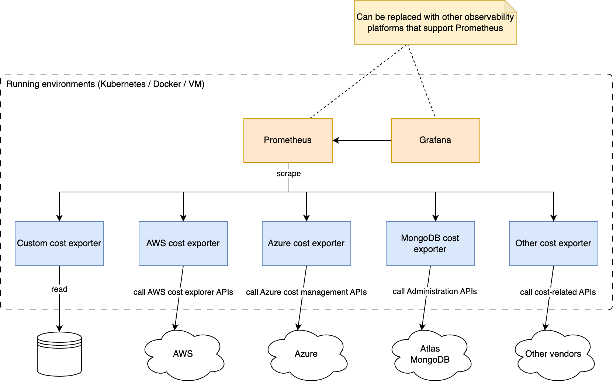

# Enhance Infrastructure Observability with Cost Metrics

In the world of SRE, we talk a lot about observability, such as metrics, logs, and traces. In most cases, these three pillars of observability are related to infrastructure metrics or business metrics. For example, the current CPU usage of a Kubernetes pod, the number of videos played by online users per minute, etc. Besides this, there is another important area that is being explored nowadays: [FinOps](https://www.finops.org/).

## What Is FinOps?

> "FinOps is an evolving cloud financial management discipline and cultural practice that enables organizations to get maximum business value by helping engineering, finance, technology and business teams to collaborate on data-driven spending decisions."
> by FinOps Foundation Technical Advisory Council

Adopting FinOps enables us to answer some key questions related to the cloud investments:

- What are the cloud costs in an organization?
- How do these cost align with the organization's business goals?
- How to optimize the cloud usage while keeping the system's performance and reliability at the same level?

## Existing Approaches

In order to analyze cloud costs, there are many cost management products available. Generally speaking, the cloud management products can be split into two categories:

- A specific tool provided by one cloud provider, such as [AWS Cost Explorer](https://aws.amazon.com/aws-cost-management/aws-cost-explorer/).
- A platform that helps manage cloud costs of multiple vendors, such as [Datadog Cloud Cost Management Portal](https://www.datadoghq.com/product/cloud-cost-management/)

The tools belong to the first category usually support one provider only since they are used for checking the costs from this provider. Furthermore, the cost information is displayed separately from other operational metrics. In the case of AWS, developers check business metrics on [CloudWatch](https://aws.amazon.com/cloudwatch/). If there is a spike in the cost of one EKS cluster, developers may switch between CloudWatch and Cost Explorer to figure out the correlations between costs and system workload.

The tools in the second category are designed with a multi-cloud mind. For example, Datadog Cloud Cost Management currently supports AWS and Azure. Of course Datadog and other teams keep improving their products and will support more cloud providers. However, they have to start from supporting mainstream cloud providers, and cannot collect all kinds of cloud costs for users. There are also some other challenges for an organization to get onboard:

- It can be difficult to choose one product only based on its features of cost management. The decision has to be made not only based on the pricing model, but also according to the effort of integrating the product with the infrastructures and services.
- The steps of adding cloud costs vary on different platforms. If an organization switches from one platform to another, it needs to configure the cost management tool from scratch.
- The cost analysis is usually done by fetching cost reports generated by cloud vendors, which are less real-time than using cost-related APIs directly.

## What We Would Like to Propose

Cost information is just as the same as other operational metrics. They can be used to identify underutilized resources, track the cost of changes to applications, and also understand the impact of changes on their costs and make informed decisions about future changes. When designing cost metrics, we recommend following [FOCUS](https://focus.finops.org/), a technical specification to build and maintain an open standard for cloud cost, usage, and billing data. When visualizing cost metrics, we recommend having them on the same dashboard with operational metrics.

In order to provide a vendor-neutral solution, we would like to implement a set of cost exporters for different vendors. The idea is to utilize their cost-related APIs to fetch the cost data, and then transform them to standard Prometheus metrics. In this way, we are able to address the challenges mentioned in the previous section:

- Regarding collecting cost data from different providers: users can always write their own custom cost exporters to report cost as metrics and have them on the same dashboard.
- Regarding choosing observability platforms, collecting Prometheus metrics is a well-known practice and is supported by most of the observability platforms. It is also free to use Prometheus and Grafana for metrics visualization.
- Regarding a migration of observability platform, there is much less work since the exporters are running in a user's own infrastructure and exporting the metrics as usual.
- Regarding the cost analysis process, it fetches the latest cost information from cloud providers. In many cases, users are able to see the cost updates within several hours.
  

The following figure shows the overall design of this solution.

Here is a list of the implemented cost exporters. MongoDB Atlas Cost Exporter will be the next one :)

- [AWS Cost Exporter](https://github.com/opensourceelectrolux/aws-cost-exporter), exposing AWS cost information as standard Prometheus metrics
- [Azure Cost Exporter](https://github.com/opensourceelectrolux/azure-cost-exporter), exposing Azure cost information as standard Prometheus metrics
- [Kubernetes Cost Exporter](https://github.com/opensourceelectrolux/kubernetes-cost-exporter), exposing Kubernetes cost information as standard Prometheus metrics